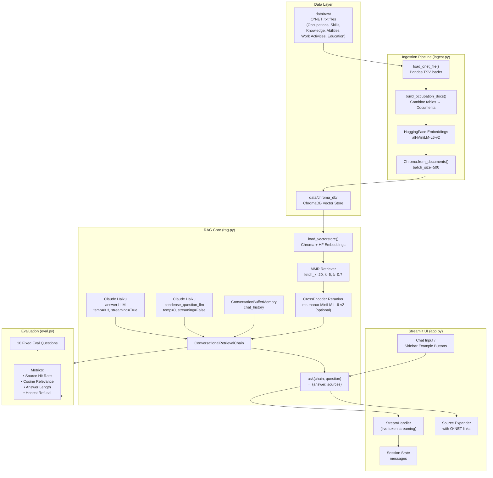

# Design Overview

This project is a **Retrieval-Augmented Generation (RAG) career chatbot** built on O*NET occupational data. Users ask natural-language questions about careers and receive grounded, cited answers from a local vector store — with no hallucinated statistics.

---

## Architecture

The system has four layers:

**1. Data Ingestion (`ingest.py`)**
O*NET tab-separated files (Occupations, Skills, Knowledge, Abilities, Work Activities, Education) are loaded with Pandas, merged into one rich text document per occupation, embedded with `all-MiniLM-L6-v2` (HuggingFace), and stored in a local ChromaDB vector store in batches of 500.

**2. RAG Core (`rag.py`)**
At query time, the user's question is first condensed (with a non-streaming Claude Haiku call) to resolve pronouns and follow-ups against the conversation history. The condensed query is then sent to an MMR retriever (fetches 20, returns 5 diverse docs), optionally re-ranked by a cross-encoder (`ms-marco-MiniLM-L-6-v2`). The final context plus chat history is passed to a streaming Claude Haiku instance that generates the answer. Conversation memory persists across turns.

**3. Streamlit UI (`app.py`)**
A chat interface with live token streaming, collapsible source citations (linked to O*NET online), and sidebar example-question buttons. State is managed via `st.session_state`.

**4. Evaluation (`eval.py`)**
A fixed 10-question benchmark measures source hit rate (did the expected occupation appear in retrieved docs?), mean cosine relevance, average answer length, and honest-refusal rate.

---

## System Diagram

